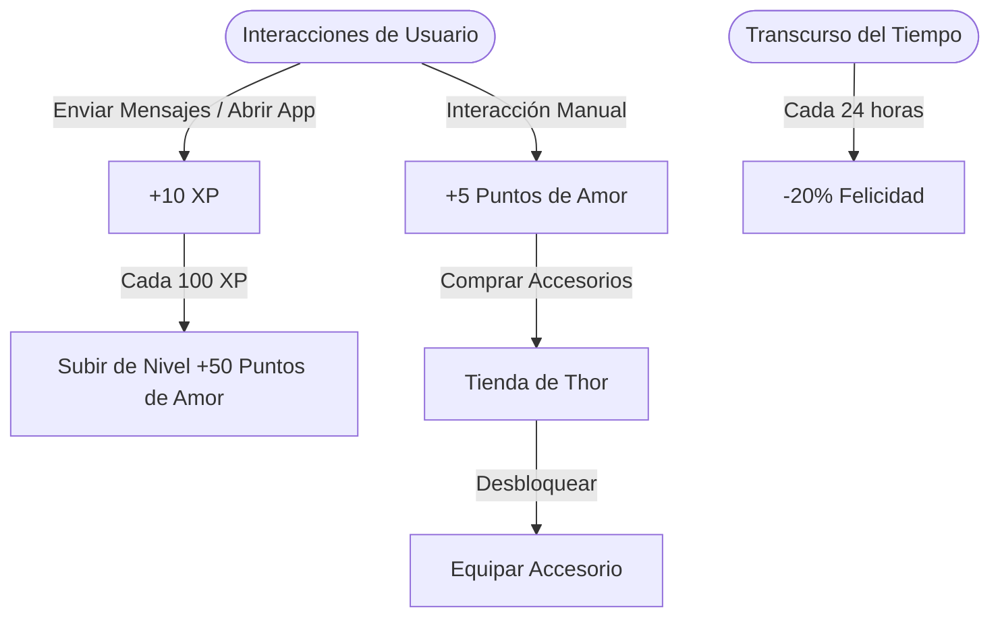

# Contexto del Proyecto: Diario Kevin & Ali (Diario Alikevin)

Este documento proporciona una guía completa y detallada de la arquitectura, stack tecnológico, sistema de gamificación y directrices del proyecto Android **Diario**, diseñado como un espacio privado, interactivo y gamificado para parejas.

---

## 1. Visión General & Propósito
**Diario** es una aplicación móvil diseñada exclusivamente para parejas. Permite registrar cartas o mensajes, compartir fotos (álbumes), agendar eventos en un calendario común y guardar recetas culinarias. Integra un fuerte componente de gamificación a través de **Thor**, una mascota virtual en formato pixel-art que reacciona a las interacciones diarias de los usuarios y progresa a través de niveles y accesorios coleccionables.

---

## 2. Stack Tecnológico
* **Lenguajes:** 
  * [Kotlin](https://kotlinlang.org/) (100% de la interfaz moderna y lógica delegada).
  * [Java](https://oracle.com/java/) (infraestructura e inicializadores heredados).
* **UI Framework:** [Jetpack Compose](https://developer.android.com/compose) (arquitectura declarativa moderna para las vistas) y vistas nativas XML en desuso (Legacy).
* **Base de Datos & Backend:**
  * **Firebase Auth:** Autenticación segura de sesiones.
  * **Cloud Firestore:** Sincronización en tiempo real y persistencia sin conexión a internet.
  * **Firebase Cloud Messaging (FCM):** Notificaciones push utilizando la API v1 mediante autenticación OAuth2 de Google.
* **Gestión de Archivos Multimedia (Imágenes):**
  * **Cloudinary:** Hosting cloud para imágenes con subida firmada directamente desde el cliente.
  * **Coil / Glide:** Carga de imágenes en memoria con caché inteligente.
  * **UCrop:** Biblioteca nativa para recortar y optimizar imágenes antes de subirlas.
* **Actualizaciones Automáticas:**
  * Integración con la **GitHub API** en [UpdateManager.kt](file:///home/kevshupp/Escritorio/Diario_alikevin/app/src/main/java/calendario/kevshupp/diariokevinali/UpdateManager.kt) para verificar versiones y descargar automáticamente nuevas entregas APK firmadas.

---

## 3. Arquitectura y Estructura del Proyecto

El código está estructurado bajo las directrices modernas de Android, delegando responsabilidades específicas:

### 📂 Clases de Infraestructura y Configuración
* [DiarioApp.java](file:///home/kevshupp/Escritorio/Diario_alikevin/app/src/main/java/calendario/kevshupp/diariokevinali/DiarioApp.java): Inicialización global de Firebase, Cloudinary, WorkManager y Coil.
* [MainActivity.java](file:///home/kevshupp/Escritorio/Diario_alikevin/app/src/main/java/calendario/kevshupp/diariokevinali/MainActivity.java): Contenedor e integrador principal. Configura la navegación de Fragments, inicializa los oyentes en tiempo real y maneja las pasarelas entre Java y Jetpack Compose.

### 📂 Vistas Jetpack Compose (`calendario.kevshupp.diariokevinali.compose`)
* [MessageFeedCompose.kt](file:///home/kevshupp/Escritorio/Diario_alikevin/app/src/main/java/calendario/kevshupp/diariokevinali/compose/MessageFeedCompose.kt): Pantalla principal. Renderiza la tarjeta interactiva de **Thor** y el feed de cartas paginado.
* [MessageEditorCompose.kt](file:///home/kevshupp/Escritorio/Diario_alikevin/app/src/main/java/calendario/kevshupp/diariokevinali/compose/MessageEditorCompose.kt): Editor pixel-art para redactar nuevas cartas, con carga multimedia y previsualización.
* [RecipeCompose.kt](file:///home/kevshupp/Escritorio/Diario_alikevin/app/src/main/java/calendario/kevshupp/diariokevinali/compose/RecipeCompose.kt) & [RecipeDetailCompose.kt](file:///home/kevshupp/Escritorio/Diario_alikevin/app/src/main/java/calendario/kevshupp/diariokevinali/compose/RecipeDetailCompose.kt): Pantallas de visualización e inserción de recetas de cocina.
* [AlbumCompose.kt](file:///home/kevshupp/Escritorio/Diario_alikevin/app/src/main/java/calendario/kevshupp/diariokevinali/compose/AlbumCompose.kt): Vista tipo grilla de todas las cartas marcadas como imágenes de álbum.
* [CalendarCompose.kt](file:///home/kevshupp/Escritorio/Diario_alikevin/app/src/main/java/calendario/kevshupp/diariokevinali/compose/CalendarCompose.kt): Calendario de eventos compartidos.

### 📂 Modelos de Datos (`calendario.kevshupp.diariokevinali`)
* [Pet.kt](file:///home/kevshupp/Escritorio/Diario_alikevin/app/src/main/java/calendario/kevshupp/diariokevinali/Pet.kt): Modelo de datos de **Thor** (Felicidad, Nivel, XP, Racha, Accesorios).
* [Message.kt](file:///home/kevshupp/Escritorio/Diario_alikevin/app/src/main/java/calendario/kevshupp/diariokevinali/Message.kt): Representación de mensajes y posts.

---

## 4. El Sistema de Gamificación de "Thor"

El motor de fidelización gira en torno a la mascota virtual de la pareja:



### A. Sistema de Progresión y Puntos
* **Interacciones:** Cada carta enviada o interacción con Thor otorga **+10 XP** y **+5 Puntos de Amor**.
* **Racha Diaria:** Mantener la interacción consecutiva incrementa el multiplicador de racha, otorgando un bono de `Racha * 2` Puntos de Amor adicionales por día.
* **Subida de Nivel:** Al acumular **100 XP**, Thor sube de nivel (`level++`), la EXP se reinicia y se premia a los usuarios con un bono de **+50 Puntos de Amor**.

### B. Tienda de Accesorios (Shop UI)
Desde el diálogo de Thor, los usuarios gastan Puntos de Amor para desbloquear y equipar 8 accesorios pixel-art. Las imágenes finales están generadas a la medida y con transparencia completa para superponerse perfectamente sobre el cuerpo del gato:
* **Collar Cascabel 🔔** (Coste: 10 Puntos)
* **Bigote Retro 🥸** (Coste: 30 Puntos)
* **Globo Corazón 🎈** (Coste: 60 Puntos)
* **Lazo Rosa 🎀** (Coste: 80 Puntos)
* **Gorrito Pixel 🎩** (Coste: 100 Puntos)
* **Pañuelo Pirata 🏴‍☠️** (Coste: 120 Puntos)
* **Lentes Cool 🕶️** (Coste: 150 Puntos)
* **Corona Real 👑** (Coste: 500 Puntos)

### C. Algoritmo de Decay y Temporizador en Tiempo Real
* **Desgaste de Felicidad:** Si la pareja no interactúa en un periodo de 24 horas, la felicidad de Thor disminuye en un **20%**. 
* **Prevención de Bucle Recursivo:** El sistema matemático en [MainActivity.java](file:///home/kevshupp/Escritorio/Diario_alikevin/app/src/main/java/calendario/kevshupp/diariokevinali/MainActivity.java) compensa el timestamp de la última interacción (`lastInteraction`) sumando bloques exactos de 24 horas por cada decaimiento aplicado. Esto previene llamadas en cascada infinitas del Snapshot Listener de Firebase.
* **Temporizador en Tiempo Real:** Implementado con una corrutina y `LaunchedEffect` en [MessageFeedCompose.kt](file:///home/kevshupp/Escritorio/Diario_alikevin/app/src/main/java/calendario/kevshupp/diariokevinali/compose/MessageFeedCompose.kt), calcula y muestra una cuenta regresiva dinámica en formato `"Próxima baja en: hh:mm"` / `"mm:ss ⏳"` que avisa cuándo ocurrirá el próximo decremento, o muestra un dulce aviso `"¡Dale amor! ❤️"` si Thor ha alcanzado el 0% de felicidad.

### D. Guía de Creación e Integración de Nuevos Accesorios / Ropa
Para añadir nuevos accesorios (como el *Plátano Nano* o las *Calcetas y Botitas*), se debe seguir un protocolo estructurado de 5 pasos para garantizar la integridad visual e interactiva:

1. **Generación del Asset Visual (AI + Transparencia Flood-Fill):**
   * **Imagen de Thor Vestido:** Generar la imagen del gato utilizando el diseño base [ic_thor_base_trans.png](file:///home/kevshupp/Escritorio/Diario_alikevin/app/src/main/res/drawable/ic_thor_base_trans.png) sobre un fondo blanco sólido (`#FFFFFF`) con el prompt deseado (ej. suéter, calcetas, sombrero).
   * **Icono de Tienda:** Generar una miniatura del accesorio individual (`ic_acc_<nombre>_raw.png`) sobre fondo blanco.
   * **Procesamiento de Transparencia:** Ejecutar un script de Python con algoritmo *Flood Fill* (partiendo de las 4 esquinas de la imagen) para remover el fondo blanco sin afectar las partes blancas del cuerpo de Thor, guardando los resultados PNG transparentes finales como `ic_thor_<nombre>.png` y `ic_acc_<nombre>.png` en `app/src/main/res/drawable/`.
2. **Definición de Constantes:**
   * Registrar la nueva constante en el companion object de [Pet.kt](file:///home/kevshupp/Escritorio/Diario_alikevin/app/src/main/java/calendario/kevshupp/diariokevinali/Pet.kt):
     ```kotlin
     const val ACC_SOCKS = "socks"
     ```
3. **Mapeo de Recursos en Compose:**
   * Añadir el recurso de imagen correspondiente en los bloques `when (pet.equippedAccessory)` ubicados en [MessageFeedCompose.kt](file:///home/kevshupp/Escritorio/Diario_alikevin/app/src/main/java/calendario/kevshupp/diariokevinali/compose/MessageFeedCompose.kt) (tanto en el renderizador principal de Thor como en el diálogo de información):
     ```kotlin
     Pet.ACC_SOCKS -> R.drawable.ic_thor_socks
     ```
4. **Registro en el Listado de la Tienda:**
   * Agregar la tupla descriptiva a la lista `items` en la pestaña de tienda dentro de [MessageFeedCompose.kt](file:///home/kevshupp/Escritorio/Diario_alikevin/app/src/main/java/calendario/kevshupp/diariokevinali/compose/MessageFeedCompose.kt) definiendo el ID, nombre para mostrar y precio en puntos de amor:
     ```kotlin
     Triple(Pet.ACC_SOCKS, "Calcetas y Botitas 🧦🥾", 15)
     ```
5. **Enlace en el Widget de Pantalla de Inicio:**
   * Mapear el nuevo accesorio en [ThorWidgetProvider.java](file:///home/kevshupp/Escritorio/Diario_alikevin/app/src/main/java/calendario/kevshupp/diariokevinali/ThorWidgetProvider.java) para mantener paridad visual fuera de la app:
     ```java
     } else if ("socks".equals(accessory)) {
         thorImageRes = R.drawable.ic_thor_socks;
     ```

---

## 5. Paginación de Cartas
Para evitar el colapso del rendimiento al leer grandes volúmenes de cartas en Firestore, el feed principal implementa una **paginación local progresiva**:
* La lista se carga inicialmente en bloques compactos de **5 cartas**.
* Al final de la lista, un botón retro pixel-art con el texto **"Mostrar más cartas ✉"** permite expandir la vista en incrementos de 5 en 5 de forma instantánea.
* Esto mantiene la aplicación veloz, fluida y con un consumo de batería y datos óptimo.

---

## 6. Estética Visual y Tematización Inmersiva
El diseño rinde homenaje al arte retro de 8 bits y 16 bits:
* **Tipografía:** vt323 (pixel art font) importada en los estilos.
* **Componentes Inmersivos:** Rectángulos puros, bordes marcados de 2dp-3dp de grosor y colores de alto contraste que simulan consolas retro.
* **Tematización Dinámica:** Soporte total en Jetpack Compose para tres esquemas estéticos que cambian la paleta de colores de toda la interfaz:
  1. **Pixel Claro:** Fondo crema suave con bordes color chocolate.
  2. **Pixel Oscuro:** Fondos en grises y negros profundos con acentos neón y rosas pixelados.
  3. **Pixel Monocromático:** Estilo minimalista puro en estricto blanco y negro.

---

## 7. Directrices para Futuros Desarrollos y Cambios
1. **Modificaciones de UI:** Todo diseño visual del feed principal debe realizarse en [MessageFeedCompose.kt](file:///home/kevshupp/Escritorio/Diario_alikevin/app/src/main/java/calendario/kevshupp/diariokevinali/compose/MessageFeedCompose.kt) respetando la consistencia de los tres temas de pixel-art (`theme`).
2. **Ciclos de Base de Datos:** Cualquier nueva estadística de la mascota debe mapearse como propiedad en [Pet.kt](file:///home/kevshupp/Escritorio/Diario_alikevin/app/src/main/java/calendario/kevshupp/diariokevinali/Pet.kt) y registrarse en el serializador de Firestore.
3. **Control de Versiones y Despliegues (CI/CD Automatizado):**
   Cada cambio que deba publicarse a producción debe seguir este proceso de despliegue automatizado mediante **GitHub Actions**:
   * **Paso 1 (Versionado):** Incrementar las propiedades `versionCode` y `versionName` en el archivo [app/build.gradle.kts](file:///home/kevshupp/Escritorio/Diario_alikevin/app/build.gradle.kts).
   * **Paso 2 (Confirmación de Cambios):** Hacer commit y push de todos los cambios de código a la rama `master`.
   * **Paso 3 (Disparador de Compilación):** Crear y empujar una etiqueta de versión que comience con `v` (ejemplo: `v1.4.5`):
     ```bash
     git tag v1.4.5
     git push origin v1.4.5
     ```
   * **Paso 4 (Ejecución en GitHub Actions):** El empuje de la etiqueta activará automáticamente el workflow en la nube definido en `.github/workflows/android.yml`.
     * El pipeline decodifica de forma segura las credenciales Base64 guardadas en los secretos de GitHub (`DIARIO_KEYSTORE_BASE64` y `GOOGLE_SERVICES_JSON_BASE64`), limpiando automáticamente posibles saltos de línea con `tr -d '\r\n '`.
     * Compila la aplicación, firma el APK de lanzamiento (Release APK), crea un lanzamiento oficial en GitHub con el nombre de la versión y adjunta el archivo `app-release.apk` firmado listo para descargar.

---

## 8. Conexión Inalámbrica de Pruebas (ADB sobre Wi-Fi)
Para conectar inalámbricamente el entorno de desarrollo al celular del usuario durante las pruebas locales (ya sea para instalar la versión Debug o Release), se debe ejecutar el siguiente comando que autodetecta y conecta el dispositivo por red local utilizando mDNS (Avahi):
```bash
adb connect $(avahi-browse -rtp _adb-tls-connect._tcp -t 2>/dev/null | grep ^= | cut -d';' -f8,9 --output-delimiter=: | head -n1)
```
