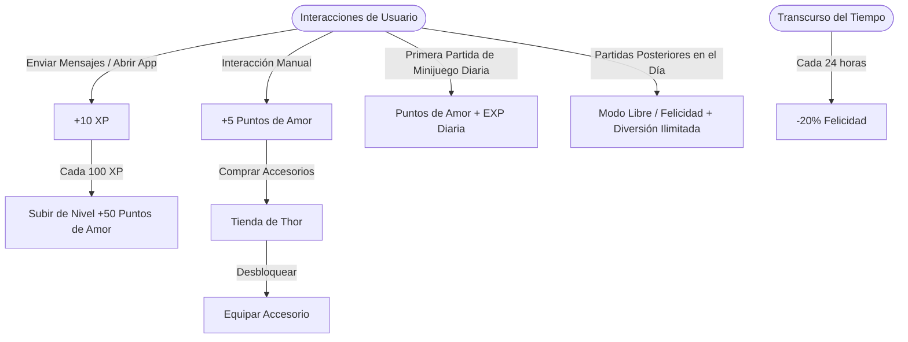

# Diario Kevin & Ali (Diario Alikevin) - Contexto General del Proyecto

Este documento sirve como la **Fuente Única de Verdad (Single Source of Truth)** para el proyecto Android **Diario**, diseñado como un espacio privado, interactivo y gamificado para parejas a la distancia. Proporciona una explicación detallada de la arquitectura, base de datos (Firestore), flujos de trabajo clave, guías de desarrollo, estructura de código y reglas de negocio para que cualquier desarrollador o inteligencia artificial pueda entender el proyecto al 100% al instante.

---

## 1. Propósito y Visión General
**Diario** es una aplicación móvil nativa para Android diseñada exclusivamente para parejas. Resuelve la falta de espacios íntimos y compartidos al digitalizar recuerdos de amor mediante pilares funcionales integrados:
1. **Diario Compartido:** Envío de cartas y mensajes con imágenes con paginación progresiva de 5 en 5, likes, visualización en grilla (álbum) y subidas directas a Cloudinary.
2. **Calendario y Recetas:** Un calendario común para recordar aniversarios/citas (con alertas automáticas) y un recetario culinario de cocina compartido con fotos e ingredientes.
3. **Mascota Virtual (Thor):** Sistema de gamificación en formato pixel-art en el que un gato virtual reacciona a la interacción diaria de la pareja, subiendo de nivel, acumulando Puntos de Amor y desbloqueando ropa/accesorios en una tienda interactiva.
4. **Sincronización Local-Nube (Google Drive)**: Respaldo y replicación automática bidireccional en segundo plano de la carpeta de fotos local seleccionada por cada usuario mediante `SyncDriveWorker` (Foreground Service), sincronizando incluso eliminaciones entre dispositivos con tombstones.
5. **Ficha Médica de Emergencia (Datos Vitales)**: Módulo interactivo dentro de la pantalla de Perfil con sincronización Firestore en tiempo real (`medical_records/<coupleId>`) que permite consultar datos médicos (grupo sanguíneo, alergias, enfermedades, seguro, remedios activos de la app y contacto de emergencia con marcación `ACTION_DIAL`) en una vista limpia de tarjetas por defecto tanto para tu ficha como para la de tu pareja, incluyendo un botón destacado `✏️ EDITAR` para modificar la información en cualquier momento.
6. **Horario de Clases Compartido (Misc -> Horario)**: Módulo interactivo dentro del menú Misceláneo con sincronización Firestore en tiempo real (`schedules/<coupleId>`). Permite registrar, editar y consultar clases de Kevin, Ali o Ambos de Lunes a Viernes en una grilla retro por horas de 145dp con arquitectura de superposición unificada (Overlay), posicionamiento proporcional exacto por minuto, tarjetas continuas sin líneas de corte, margen de horas automático, soporte de solapamientos simultáneos y diseño adaptable para rotación horizontal (Landscape).
7. **Gestión de Medicamentos de Rutina (Misc -> Medicamentos)**: Módulo interactivo para programar tomas diarias/periódicas de remedios con alarmas exactas gestionadas vía `AlarmManager` y notificación push persistente (`MedicationReceiver`).
8. **Lista de Anime Compartida (Misc -> Anime)**: Dashboard interactivo para llevar el registro de animes vistos o por ver juntos, episodios actuales, calificación y estado de emisión.
9. **Checklist de Espíritus Fortnite & Web de Gestión (Misc -> Espíritus / Web)**: Coleccionable interactivo de 117 espíritus con maestrías, categorías y renombrado en tiempo real, sincronizado mediante Firestore (`fortnite_spirits/<coupleId>`) con una Web de Gestión externa en Node.js / Vercel Serverless.

---

## 2. Stack Tecnológico y Arquitectura

- **Plataforma / Lenguajes:** Android Nativo.
  - **Kotlin:** Utilizado en el 98% de la lógica de negocio, ViewModels, pantallas de Jetpack Compose, Workers y utilidades en segundo plano.
  - **Java:** Restringido al controlador de la interfaz principal (`MainActivity.java`), que interactúa con la lógica moderna de Kotlin mediante `MainViewModel`.
- **UI Framework:**
  - **Jetpack Compose:** Sistema declarativo moderno utilizado en la totalidad de las pantallas (cartas, álbum, calendario, recetas, ficha médica, medicamentos, horario, espíritus, anime, perfil y configuración de sincronización).
  - **Vanilla XML / ViewBinding:** En desuso, restringido a ciertos componentes legados y layouts de Widgets de pantalla de inicio.
- **Base de Datos y Backend:**
  - **Firebase Auth:** Gestión de inicio de sesión de los usuarios.
  - **Cloud Firestore:** Almacenamiento NoSQL en tiempo real con persistencia offline integrada (caching local SQLite automática) para cartas, recetas, eventos, fichas médicas, medicamentos, animes, horarios de clases e información de la mascota.
  - **Firebase Cloud Messaging (FCM):** Notificaciones push utilizando la API v1 mediante autenticación OAuth2.
- **Servicios Externos / APIs:**
  - **Google Drive API (v3):** Respaldo directo en la nube en una carpeta oculta (`DiarioAliKevin_Album`).
  - **Cloudinary:** Hosting cloud multimedia. Las fotos de las cartas se suben de forma firmada directamente a Cloudinary.
  - **GitHub API:** Localizada en [UpdateManager.kt](file:///home/kevin/Escritorio/Proyectos/Diario_alikevin/app/src/main/java/calendario/kevshupp/diariokevinali/UpdateManager.kt) para verificar actualizaciones del APK e instalarlas automáticamente.
- **Colección de Espíritus / Coleccionables:**
  - **Checklist de Espíritus:** Un listado interactivo en el juego compuesto por **117 espíritus**. Su registro en código reside en `SpiritsCompose.kt` y `MiscCompose.kt` y sus activos de imagen pixel-art están almacenados en los recursos drawables y Cloudinary. El **Modo Edición** permite renombrar espíritus y categorías, mover espíritus a diferentes categorías y eliminar tanto espíritus como categorías de forma compartida guardando los cambios en Firestore (`fortnite_spirits/<coupleId>`).
- **Estilos y UI:**
  - Estética inmersiva **Retro Pixel-Art de 8 y 16 bits**.
  - Tipografía pixelada `vt323` importada globalmente.
  - Soporte a tres temas visuales dinámicos: **Pixel Claro** (crema y chocolate), **Pixel Oscuro** (gris profundo y neón rosa) y **Pixel Monocromático** (blanco y negro puro).
  - **Sincronización de Tema Web-App:** El selector de temas en la pestaña *Configuración* de la web sincroniza en tiempo real el campo `theme` dentro del documento `users/<userId>` de Firestore. Al cambiar el tema desde la web o desde la app, ambos entornos adaptan sus colores e interfaz al instante.

---

## 3. Estructura del Proyecto y Archivos Clave

El código fuente está localizado en `app/src/main/java/calendario/kevshupp/diariokevinali/`.

### 📁 Inicialización e Infraestructura
- [DiarioApp.kt](file:///home/kevin/Escritorio/Proyectos/Diario_alikevin/app/src/main/java/calendario/kevshupp/diariokevinali/DiarioApp.kt): Punto de entrada en Kotlin. Configura las instancias globales de Cloudinary, WorkManager, Firebase y Coil.
- [MainActivity.java](file:///home/kevin/Escritorio/Proyectos/Diario_alikevin/app/src/main/java/calendario/kevshupp/diariokevinali/MainActivity.java): Contenedor principal. Orquesta las vistas de Compose observando los estados del ViewModel y delega la lógica de negocio.
- [LoginActivity.kt](file:///home/kevin/Escritorio/Proyectos/Diario_alikevin/app/src/main/java/calendario/kevshupp/diariokevinali/LoginActivity.kt): Gestión del login y asociación del `coupleId`.
- [MainViewModel.kt](file:///home/kevin/Escritorio/Proyectos/Diario_alikevin/app/src/main/java/calendario/kevshupp/diariokevinali/MainViewModel.kt): ViewModel central en Kotlin. Administra el estado global, listeners de Firestore en tiempo real, alarmas de calendario y toda la lógica de interacción/decay del pet Thor.

### 📁 Sincronización en Segundo Plano y Gestión de Archivos
- [SyncDriveWorker.kt](file:///home/kevin/Escritorio/Proyectos/Diario_alikevin/app/src/main/java/calendario/kevshupp/diariokevinali/SyncDriveWorker.kt): Trabajador de primer plano (`CoroutineWorker` promovido a Foreground Service). Maneja la lógica de subir/descargar fotos pendientes de forma optimizada y control de borrados bidireccionales.
- [SyncScheduler.kt](file:///home/kevin/Escritorio/Proyectos/Diario_alikevin/app/src/main/java/calendario/kevshupp/diariokevinali/SyncScheduler.kt): Orquestador de WorkManager. Agenda sincronizaciones periódicas (con restricciones de red Wi-Fi y carga eléctrica) o inmediatas bajo demanda.
- [DuplicateManager.kt](file:///home/kevin/Escritorio/Proyectos/Diario_alikevin/app/src/main/java/calendario/kevshupp/diariokevinali/DuplicateManager.kt): Gestor de detección y limpieza de imágenes duplicadas mediante pre-filtrado por tamaño y comparación MD5.

### 📁 Notificaciones y Widgets
- [ThorWidgetProvider.kt](file:///home/kevin/Escritorio/Proyectos/Diario_alikevin/app/src/main/java/calendario/kevshupp/diariokevinali/ThorWidgetProvider.kt): Widget de escritorio que dibuja el estado actual de Thor y sus accesorios equipados.
- [LastMessageWidget.kt](file:///home/kevin/Escritorio/Proyectos/Diario_alikevin/app/src/main/java/calendario/kevshupp/diariokevinali/LastMessageWidget.kt) / [LastMessageLargeWidget.kt](file:///home/kevin/Escritorio/Proyectos/Diario_alikevin/app/src/main/java/calendario/kevshupp/diariokevinali/LastMessageLargeWidget.kt): Widgets de escritorio con vista previa de la última carta recibida de la pareja.
- [MedicationAlarmScheduler.kt](file:///home/kevin/Escritorio/Proyectos/Diario_alikevin/app/src/main/java/calendario/kevshupp/diariokevinali/MedicationAlarmScheduler.kt) & [MedicationReceiver.kt](file:///home/kevin/Escritorio/Proyectos/Diario_alikevin/app/src/main/java/calendario/kevshupp/diariokevinali/MedicationReceiver.kt): Sistema de alarmas exactas para recordatorios de medicamentos.

### 📁 Actualizaciones Automáticas
- [UpdateManager.kt](file:///home/kevin/Escritorio/Proyectos/Diario_alikevin/app/src/main/java/calendario/kevshupp/diariokevinali/UpdateManager.kt) & [UpdateWorker.kt](file:///home/kevin/Escritorio/Proyectos/Diario_alikevin/app/src/main/java/calendario/kevshupp/diariokevinali/UpdateWorker.kt): Consulta de la API de GitHub Releases, descarga de la APK firmada e instalación automática.

### 📁 Pantallas en Jetpack Compose (`compose/`)
- [MessageFeedCompose.kt](file:///home/kevin/Escritorio/Proyectos/Diario_alikevin/app/src/main/java/calendario/kevshupp/diariokevinali/compose/MessageFeedCompose.kt): Feed principal con paginación de 5 en 5 cartas, tarjeta de **Thor** con animaciones, estado de racha y diálogo de confirmación de borrado.
- [PetDialogCompose.kt](file:///home/kevin/Escritorio/Proyectos/Diario_alikevin/app/src/main/java/calendario/kevshupp/diariokevinali/compose/PetDialogCompose.kt): Diálogo interactivo a pantalla completa de **Thor** (Habitación 2D, animación de baño, pelota, tienda de ropa/fondos, alimentos, ajustes y selector de minijuegos).
- [MemoryGameCompose.kt](file:///home/kevin/Escritorio/Proyectos/Diario_alikevin/app/src/main/java/calendario/kevshupp/diariokevinali/compose/MemoryGameCompose.kt): Minijuego Retro Memory (Juego de Memoria con cartas pixel-art de los accesorios de Thor).
- [MessageEditorCompose.kt](file:///home/kevin/Escritorio/Proyectos/Diario_alikevin/app/src/main/java/calendario/kevshupp/diariokevinali/compose/MessageEditorCompose.kt): Editor y redactor de cartas con selección multimedia y subida directa a Cloudinary.
- [AlbumCompose.kt](file:///home/kevin/Escritorio/Proyectos/Diario_alikevin/app/src/main/java/calendario/kevshupp/diariokevinali/compose/AlbumCompose.kt): Grilla de fotos retro con filtros por fecha, visor de pantalla completa e información del archivo.
- [SettingsSyncCompose.kt](file:///home/kevin/Escritorio/Proyectos/Diario_alikevin/app/src/main/java/calendario/kevshupp/diariokevinali/compose/SettingsSyncCompose.kt): Interfaz retro para vincular Google Drive, selector de líneas paralelas de subida (1 a 5) y contadores dinámicos.
- [ProfileSettingsCompose.kt](file:///home/kevin/Escritorio/Proyectos/Diario_alikevin/app/src/main/java/calendario/kevshupp/diariokevinali/compose/ProfileSettingsCompose.kt): Editor del perfil de la pareja (Kevin & Ali) con contador dinámico de tiempo juntos.
- [MedicalCompose.kt](file:///home/kevin/Escritorio/Proyectos/Diario_alikevin/app/src/main/java/calendario/kevshupp/diariokevinali/compose/MedicalCompose.kt): Ficha médica de emergencia con grupo sanguíneo, alergias, seguros y llamadas directas.
- [MedsCompose.kt](file:///home/kevin/Escritorio/Proyectos/Diario_alikevin/app/src/main/java/calendario/kevshupp/diariokevinali/compose/MedsCompose.kt): Gestión e historial de la toma de remedios y medicamentos de la pareja.
- [AnimeCompose.kt](file:///home/kevin/Escritorio/Proyectos/Diario_alikevin/app/src/main/java/calendario/kevshupp/diariokevinali/compose/AnimeCompose.kt): Dashboard interactivo de animes compartidos (vistos, en emisión, pendientes).
- [SpiritsCompose.kt](file:///home/kevin/Escritorio/Proyectos/Diario_alikevin/app/src/main/java/calendario/kevshupp/diariokevinali/compose/SpiritsCompose.kt): Checklist de 117 espíritus de Fortnite, renombrados, categorías y variantes.
- [RecipeCompose.kt](file:///home/kevin/Escritorio/Proyectos/Diario_alikevin/app/src/main/java/calendario/kevshupp/diariokevinali/compose/RecipeCompose.kt) & [RecipeDetailCompose.kt](file:///home/kevin/Escritorio/Proyectos/Diario_alikevin/app/src/main/java/calendario/kevshupp/diariokevinali/compose/RecipeDetailCompose.kt): Libro de recetas de cocina compartido.
- [CalendarCompose.kt](file:///home/kevin/Escritorio/Proyectos/Diario_alikevin/app/src/main/java/calendario/kevshupp/diariokevinali/compose/CalendarCompose.kt): Vista mensual de citas y eventos de la pareja.
- [ScheduleCompose.kt](file:///home/kevin/Escritorio/Proyectos/Diario_alikevin/app/src/main/java/calendario/kevshupp/diariokevinali/compose/ScheduleCompose.kt): Grilla de Horario de Clases compartido de Lunes a Viernes con superposición Overlay, tarjetas de 145dp, cálculo proporcional y soporte horizontal.
- [FlappyThorCompose.kt](file:///home/kevin/Escritorio/Proyectos/Diario_alikevin/app/src/main/java/calendario/kevshupp/diariokevinali/compose/FlappyThorCompose.kt): Minijuego arcade retro Flappy Thor con selector de modo (Pantalla Completa / Consola Pocket), física calibrada, motor de sonido 8-bits procedimental, corazones coleccionables y recompensas.
- [SnakeGameCompose.kt](file:///home/kevin/Escritorio/Proyectos/Diario_alikevin/app/src/main/java/calendario/kevshupp/diariokevinali/compose/SnakeGameCompose.kt): Minijuego clásico La Serpiente con selector de modo (Pantalla Completa con gestos táctiles Swipe y D-PAD ergonómico / Consola Pocket), efectos de sonido y puntuación.
- [MiscCompose.kt](file:///home/kevin/Escritorio/Proyectos/Diario_alikevin/app/src/main/java/calendario/kevshupp/diariokevinali/compose/MiscCompose.kt): Menú principal misceláneo que da acceso a Espíritus, Anime, Web de Gestión, Medicamentos y Horario.

---

## 4. Modelos de Datos y Entidades en Firestore

### A. Mascota (`pets/<coupleId>`) - `Pet.kt`
- `happiness: Int` (Felicidad de 0 a 100).
- `level: Int` (Nivel actual, inicia en 1).
- `lovePoints: Int` (Monedas acumuladas para la tienda).
- `experience: Int` (Experiencia acumulada de 0 a 100).
- `streakDays: Int` (Racha de días interactuando).
- `lastInteraction: Long` (Timestamp del último contacto).
- `equippedAccessory: String?` (ID del accesorio activo).
- `unlockedAccessories: List<String>` (Colección de accesorios comprados).

### B. Cartas (`messages/<messageId>`) - `Message.kt`
- `messageId: String?` (Clave en Firestore).
- `authorId: String?` / `authorName: String?` (Detalles del creador).
- `content: String?` (Texto de la carta).
- `imageUrls: MutableList<String>?` (URLs de Cloudinary).
- `timestamp: Long` (Fecha de publicación).
- `liked: Boolean` (Estado de me gusta / favorito).
- `type: String?` (`MESSAGE` o `ALBUM`).

### C. Horario de Clases (`schedules/<coupleId>`) - `ScheduleCompose.kt`
- `classes: List<Map<String, Any>>`
  - `id: String`, `name: String`, `teacher: String`, `room: String`
  - `dayOfWeek: Int` (1: Lunes, 2: Martes, 3: Miércoles, 4: Jueves, 5: Viernes)
  - `startHour: Int`, `startMinute: Int`, `endHour: Int`, `endMinute: Int`
  - `owner: String` (`"kevin"`, `"ali"`, `"both"`)
  - `colorHex: String`

### D. Ficha Médica (`medical_records/<coupleId>`) - `MedicalCompose.kt`
- `bloodType: String`, `allergies: String`, `conditions: String`
- `dailyMeds: String`, `insurance: String`, `emergencyContactName: String`, `emergencyContactPhone: String`

### E. Medicamentos (`medications/<coupleId>`) - `MedsCompose.kt`
- `name: String`, `dosage: String`, `frequencyHours: Int`, `nextTakeTimestamp: Long`, `owner: String`

### F. Anime (`anime_list/<coupleId>`) - `AnimeCompose.kt`
- `title: String`, `episodesWatched: Int`, `totalEpisodes: Int`, `rating: Float`, `status: String` (`"WATCHING"`, `"COMPLETED"`, `"PLAN_TO_WATCH"`)

### G. Metadatos de Sincronización Drive (`pets/<coupleId>/drive_sync_metadata/<docId>`)
- `idLocal: String`, `idDrive: String`, `nombreArchivo: String`, `uriLocal: String`, `md5Checksum: String`, `fechaModificacion: Long`, `sincronizadoPor: String`, `eliminado: Boolean`.

### H. Colección de Espíritus Fortnite (`fortnite_spirits/<coupleId>` para Temporada 1 / `fortnite_spirits_s2/<coupleId>` para Temporada 2)
- **Soporte Multitemporada:**
  - **Temporada 1**: Contiene la colección original de espíritus (1 a 141), categorías y estado histórico de checks y maestrías.
  - **Temporada 2 (Por defecto)**: Colección activa para los nuevos espíritus, variantes y categorías creadas en la Web de Gestión con registro independiente de checks y maestrías.
- `schema_version: Int` (Versión 4).
- `categories: List<SpiritCategory>` / `Map`
- `spirits_list: List<String>`
- `kevin_list: List<String>` / `ali_list: List<String>`
- `kevin_mastery: List<String>` / `ali_mastery: List<String>`
- `custom_names: Map<String, String>`, `custom_categories: Map<String, String>`, `custom_images: Map<String, String>`, `spirit_types: List<SpiritType>`.

---

## 5. El Sistema de Gamificación de "Thor"

- **Mecánica de Minijuegos (Retro Memory, Flappy Thor, La Serpiente):**
  - **Recompensa Diaria (1ª partida del día):** Otorga los Puntos de Amor (❤️) y EXP (✨) correspondientes automáticamente al terminar/perder la partida, activando el *Modo Libre*.
  - **Modo Libre Ilimitado:** Una vez reclamada la recompensa diaria, los minijuegos **nunca se bloquean**. Los usuarios pueden seguir jugando infinitamente para batir récords y divertirse.
  - **Ranking de Récords de Pareja:** Se persisten y sincronizan en Firestore los mejores récords de Kevin y Ali (`flappyHighScoreKevin`, `flappyHighScoreAli`, `snakeHighScoreKevin`, `snakeHighScoreAli`), mostrándose en el selector y en las pantallas de fin de partida.
  - **Dificultad Dinámica en Flappy Thor:** Tuberías generadas con aperturas y alturas variables (aperturas estrechas desafiantes con recompensas de corazones, tuberías extremas y aceleración progresiva).
  - **Selector de Minijuegos Ampliado:** Diálogo con mayor espacio visual, badges de récords de pareja y estado claro de recompensa diaria vs modo libre.

## 6. Flujos de Sincronización (Google Drive & Firestore)

1. **Resolución SAF en Android**: Se evita `DocumentFile.listFiles()` por lentitud. Se usa `contentResolver.query` con proyecciones mínimas y se opera en memoria.
2. **Reconciliación de Borrados Bidireccional**:
   - Foto borrada localmente -> se elimina en Drive y se marca `eliminado = true` en Firestore (Borrado local replicado en nube).
   - Foto con metadato `eliminado == true` -> se borra el archivo físico local (Borrado remoto replicado en el dispositivo).
3. **Lazy MD5 Hashing**: El cálculo de hash MD5 solo se ejecuta cuando los timestamps difieren o para archivos totalmente nuevos.
4. **Subida Paralela**: Controlada por corroutines y `Semaphore` configurable de 1 a 5 slots.

---

## 7. Despliegue Automatizado y Pruebas Multidispositivo

### CI/CD en GitHub Actions
- **Incrustar versión obligatoria:** Antes de publicar, incrementar `versionCode` y `versionName` en [app/build.gradle.kts](file:///home/kevin/Escritorio/Proyectos/Diario_alikevin/app/build.gradle.kts).
- **Creación de Tag:** Empujar el tag `v<versionName>` a `master` dispara el workflow `.github/workflows/android.yml`, el cual firma y publica `app-release.apk` en GitHub Releases.

### Actualizaciones Silenciosas Desatendidas (Android 12+ / PackageInstaller)
- **Instalación sin Diálogos en Android 12+ (API 31+):** Se utiliza `PackageInstaller.SessionParams` con `setRequireUserAction(USER_ACTION_NOT_REQUIRED)` y streaming de flujo de entrada (`openInputStream`/`openWrite`). La app se actualiza silenciosamente en segundo plano sin mostrar la ventana del instalador del sistema.
- **Recepción de Estado:** `InstallResultReceiver` escucha el resultado del commit (`STATUS_SUCCESS` o `STATUS_PENDING_USER_ACTION` para fallback con confirmación de usuario).
- **Fallback Automático (Android 11 o inferior):** Si la API nativa de Android 12+ no está disponible o falla, la app abre directamente el instalador con `Intent.ACTION_VIEW`.

### Conexión ADB Multidispositivo (`conectar_adb.sh`)
- Script interactivo en el escritorio para mDNS QR code pairing, selección múltiple en Zenity e instalación directa acelerada por Gradle cache.

---

## 8. Web de Gestión & Servidor Vercel

- **Ruta Web:** `web/index.html`
- **Servidor Local:** `web/server.js` (Express en port 8000).
- **Vercel Serverless Function:** `web/api/upload-spirit-image.js` (Firmado y subida directa de Base64 comprimido a Cloudinary).
- **Sincronización de Tema:** Modificar `theme` en la web actualiza el documento Firestore `users/<userId>` y adapta al instante los colores en la App Android.

---

## 9. Optimizaciones de Memoria y Rendimiento Aplicadas

1. **Protección de Desregistro de NetworkCallback**: Se encapsuló el desregistro de red en `MainActivity.kt` dentro de bloques `try-catch` para evitar fallos por `IllegalArgumentException` al cerrar la Activity.
2. **Downsampling Preventivo de Bitmaps (`ImageUtils.kt`)**: Funciones `calculateInSampleSize` y `decodeSampledBitmapFromUri` añadidas para decodificar fotos pesadas de la cámara en resoluciones máximas optimizadas (1200px), evitando fugas de memoria RAM (`OutOfMemoryError`).
3. **Memorización de Keys y Lambdas en Listas Compose**: Garantizada la estabilidad de listas mediante `key` únicos en `LazyColumn` en [`MessageFeedCompose.kt`](file:///home/kevin/Escritorio/Proyectos/Diario_alikevin/app/src/main/java/calendario/kevshupp/diariokevinali/compose/MessageFeedCompose.kt) para prevenir recomposiciones completas de la lista cuando la app recibe actualizaciones de Firebase.
4. **Caché de `SharedPreferences` vía `remember(context)`**: Apertura del XML de preferencias encapsulada en `remember` en todas las pantallas de Compose ([`AnimeCompose.kt`](file:///home/kevin/Escritorio/Proyectos/Diario_alikevin/app/src/main/java/calendario/kevshupp/diariokevinali/compose/AnimeCompose.kt), [`MedsCompose.kt`](file:///home/kevin/Escritorio/Proyectos/Diario_alikevin/app/src/main/java/calendario/kevshupp/diariokevinali/compose/MedsCompose.kt), [`ScheduleCompose.kt`](file:///home/kevin/Escritorio/Proyectos/Diario_alikevin/app/src/main/java/calendario/kevshupp/diariokevinali/compose/ScheduleCompose.kt), etc.), evitando I/O de disco repetido durante renderizados.
5. **Intervalo Dinámico en Temporizador de Thor**: El temporizador dinámico `rememberTimeUntilDecay` en [`MessageFeedCompose.kt`](file:///home/kevin/Escritorio/Proyectos/Diario_alikevin/app/src/main/java/calendario/kevshupp/diariokevinali/compose/MessageFeedCompose.kt) adapta su intervalo de actualización a 5000ms mientras quedan horas disponibles, reduciendo en un 80% el consumo de CPU y batería.

---

## 10. Últimos Hitos Implementados (Temporada 2 Espíritus & Herramientas Web)

1. **Separación Multitemporada en Espíritus:**
   - **Temporada 1:** Preserva los 141 espíritus originales y su historial en `fortnite_spirits/<coupleId>`.
   - **Temporada 2:** Nueva colección activa por defecto en `fortnite_spirits_s2/<coupleId>`.
   - Selector de temporada interactivo integrado en la App (`[T2] / [T1]`) y en la Web (`[🌟 Temporada 2] / [🕰️ Temporada 1]`).
2. **Extracción y Procesamiento de la Planilla Fortnite Override (Capítulo 7 T4):**
   - Recorte y limpieza con transparencia antialiasing de **36 nuevos espíritus** (12 personajes con 3 variantes: *Normal*, *Dorado*, *Hacker*).
   - Subida y alojamiento automático en Cloudinary (`spirits_s2/ic_spirit_s2_01` a `36`).
   - Activos individuales preservados localmente en `scripts/spirits_s2_extracted/` (`spirit_s2_01.png` a `spirit_s2_36.png`).
3. **Sincronización Automática de Nombres al Renombrar Categorías:**
   - Al cambiar el nombre de cualquier categoría (ej. *"Espíritu de Rex"* ➔ *"Espíritu de Klombo"*), tanto la Web (`web/config.html`, `/edit`) como la App Android (`SpiritsCompose.kt`) detectan todos los espíritus pertenecientes a esa categoría, preservan sus sufijos de tipo (*Normal, Dorado, Hacker, etc.*) y actualizan en tiempo real los registros en `custom_names` y `custom_categories` en Firestore.
4. **Rediseño Completo del Editor de Imágenes Studio (Recorte & Quitar Fondo):**
   - **Caja de Selección Interactiva con 8 Puntos de Ajuste**: Detección sensible adaptable por DPI/pantalla, arrastre de los 4 bordes (`↕️`, `↔️`) y las 4 esquinas (`nwse-resize`, `nesw-resize`), y desplazamiento de la caja completa.
   - **Proporción 1:1 Cuadrada o Libre**: Selector para forzar proporción cuadrada o ajuste libre.
   - **Exportación 100% Limpia sin Artefactos (`getCleanStudioDataUrl`)**: Extracción de píxeles puros directamente de la imagen base original en un lienzo secundario aislado, evitando que las líneas magentas, la cuadrícula o los puntos de control queden estampados en el PNG subido a Cloudinary.
   - **Auto-recorte al Guardar y Subir**: Si una selección está activa al pulsar *"Guardar y Subir Espíritu"*, se recorta y procesa automáticamente sin pasos intermedios.
   - **Historial de Deshacer (`↩️ Deshacer`)**: Posibilidad de revertir recortes, borrados de pincel y extracciones de color.
   - **Soporte Táctil y Móvil**: Eventos Pointer (`pointerdown`, `pointermove`, `pointerup`) para edición fluida en PC, tablets y móviles.
   - **Indicador de Dimensiones en Barra de Herramientas**: Medidas `W × H px` ubicadas en la barra de controles para no obstruir la imagen.
5. **Servidor Local y Enrutamiento SPA Limpio (`web/server.py`):**
   - Servidor Python backend en puerto 8000 con enrutamiento SPA directo sin redirecciones permanentes 301.
   - Normalización de URLs en el cliente (`replaceState`) para mantener rutas limpias (`http://localhost:8000/`, `/edit`, `/config`, `/db`).
6. **Selector de Tasa de Refresco (Hz) Sincronizado en App & Web:**
   - Opciones dinámicas de **60 Hz (Batería), 90 Hz (Por Defecto / Recomendado), 100 Hz y 120 Hz (Ultra Fluido)**.
   - Sincronización en tiempo real en Firestore (`users/<userId>/refreshRate`) con persistencia local en `SharedPreferences`.
   - Aplicación técnica a bajo nivel en Android mediante `preferredDisplayModeId` (API 23+) y coincidencia óptima con la resolución activa de la pantalla.
7. **Release v1.7.37:** Publicada en GitHub Releases vía CI/CD con tag `v1.7.37` (versionCode 82).

---

## 11. Tareas Pendientes / Backlog

*(Sin tareas pendientes inmediatas).*

